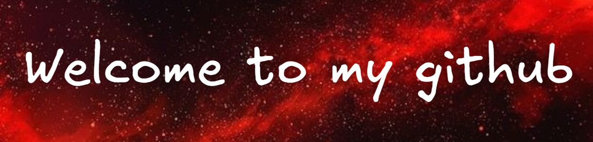

  

## Bonjour ! Hi ! 
Je suis étudiant en informatique à l'IUT Robert Schuman.
 
I'm a student in computer science at the IUT Robert Schuman.

Mes passe-temps sont : jouer aux jeux vidéos, faire du sport et cuisiner.
 
My hobbies are : play to video games, doing exercise, cooking.

Ma musique préférée : Take me to the beach - Imagine Dragons
 
My favorite song : Take me to the beach - Imagine Dragons

  

## Langages / Languages

  <a href="https://skillicons.dev">
    
     
    
  </a>

## Outils / Tools

  <a href="https://skillicons.dev">
   
     
    
  </a>

## Projets / Projects

Quelques projets réalisé dans le cadre du BUT informatique / Some projects that I did as part of the BUT : 

- [Jeu de Yam's / Yams Game](https://github.com/noahdumangin/Yams) : Jeu en C# du Yams puis affichage des résultats sur site web / Yams game developed in C#, with results displayed on a website
   
- [Doojons and Dragons](https://github.com/noahdumangin/DOOjons-Et-Dragons)  : Jeu de rôle en Java / Role-Playing Game in Java
   
- [Sudoku](https://github.com/noahdumangin/Sudoku)  : Solveur de sudoku en Assembleur / Sudoku solver in Assembly
   
- [Application de gestion de base de données / Database Management Application](https://github.com/noahdumangin/Appli_gestion_pompiers)  : Gestion de pompiers en C# avec Visual Studio 2022 / Firefighter Management Application in C# using Visual Studio 2022
   
- [Simulation de réseaux / Network Simulation](https://github.com/noahdumangin/Simulation_de_reseau_en_C) : Simule une LAN avec des switchs et des postes en C / LAN simulation project using C, including switches and workstations setup
   
- (Ajouté en mi-décembre 2025) Jeu sérieux: Clicker pour automatisation d'audit / (Added mid-December 2025) Serious Game: Clicker for Audit Automation

## Statistiques / Statistics

  

