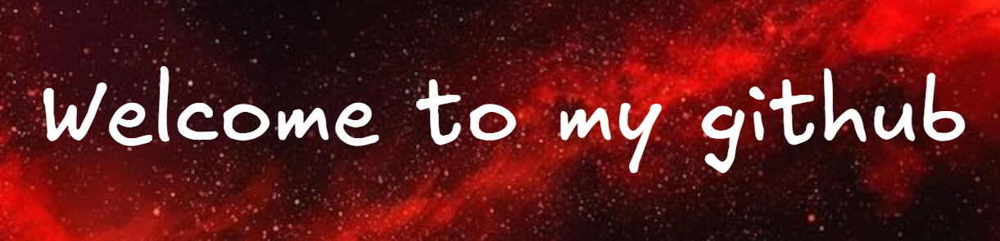

  

## Bonjour !
Je suis étudiant en informatique à l'IUT Robert Schuman.
 

Mes passe-temps sont : jouer aux jeux vidéos, faire du sport et cuisiner.
 

Ma musique préférée : Take me to the beach - Imagine Dragons

  

## Langages

  <a href="https://skillicons.dev">
    
     
    
  </a>

## Outils

  <a href="https://skillicons.dev">
   
     
    
  </a>

## Projets

Quelques projets réalisé dans le cadre du BUT informatique : 
- [Cramé mais diplômé](https://github.com/noahdumangin/Crame-mais-diplome) : Application web mettant en scène les différents types d'étudiants et leur santé mentale
- [StackOverlivre](https://github.com/noahdumangin/StackOverLivre) : Application android studio et application web de gestion de livres et d'auteurs
- [Bataille navale](https://github.com/noahdumangin/Bataille_navale) : Bataille navale en Java avec règles supplémentaires
- [Jeu sérieux (Clicker)](https://github.com/noahdumangin/Clicker-audit-automatisation) : Clicker pour automatisation d'audit
- [2048](https://github.com/noahdumangin/2048) : Jeu de 2048 en C sur terminal linux
- [Jeu de Yam's](https://github.com/noahdumangin/Yams) : Jeu en C# du Yams puis affichage des résultats sur site web
- [Doojons and Dragons](https://github.com/noahdumangin/DOOjons-Et-Dragons)  : Jeu de rôle en Java
- [Gestionnaire de tâches](https://github.com/noahdumangin/gestionnaire_de_taches) : Liste de tâches en Javascript et React
- [Application de gestion de base de données](https://github.com/noahdumangin/Appli_gestion_pompiers)  : Gestion de pompiers en C# avec Visual Studio 2022
- [Sudoku](https://github.com/noahdumangin/Sudoku)  : Solveur de sudoku en Assembleur
- [Simulation de réseaux](https://github.com/noahdumangin/Simulation_de_reseau_en_C) : Simule une LAN avec des switchs et des postes en C
